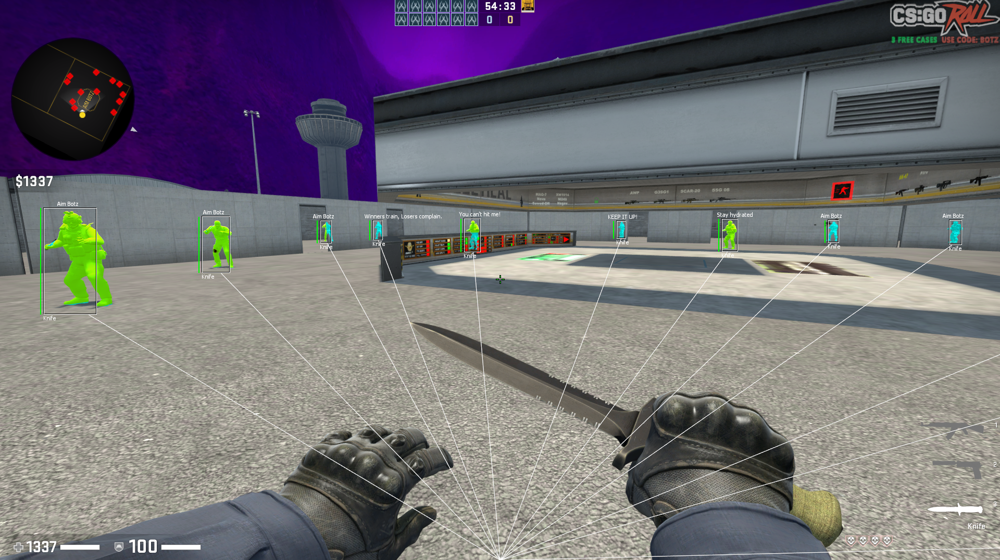

# Cartman V2
Internal CS:GO cheat written for Windows with IMGUI

See other images in the screenshot folder!

### Features
#### Visuals:
- Chams
- Sky colour editor
- Sky box editor
#### Aim:
- Aim bot
- Trigger bot
- Recoil control system
#### Miscallenous:
- Anti flash
- Bunny Hop \w auto strafe
- Grenade trajectory prediction
- Visible sniper crosshair

### Injection:
Any DLL injector should work. Although I used [*roids*](https://github.com/IVBecy/roids)

### Compilation:
Open *cartmanv2.sln* and change the build config to `Release | x86` and press build.
At the end you should receive `cartmanv2.dll`

### Credits:
Credits to [*Guided Hacking*](https://www.youtube.com/@GuidedHacking) for the all their tutorials and help.    
Lots of thanks to [*Ocornut*](https://github.com/ocornut) for and amazing library, that is [*imgui*](https://github.com/ocornut/imgui)    
Also, credits to [*TsudaKageyu*](https://github.com/TsudaKageyu) for [*MinHook*](https://github.com/TsudaKageyu/minhook)